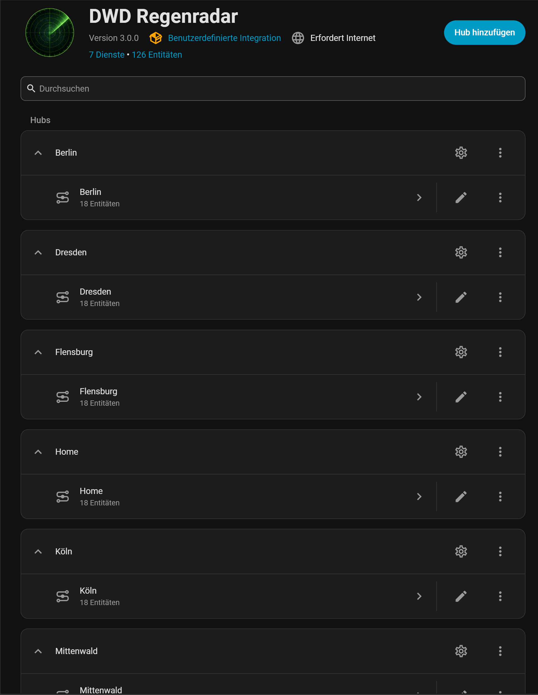
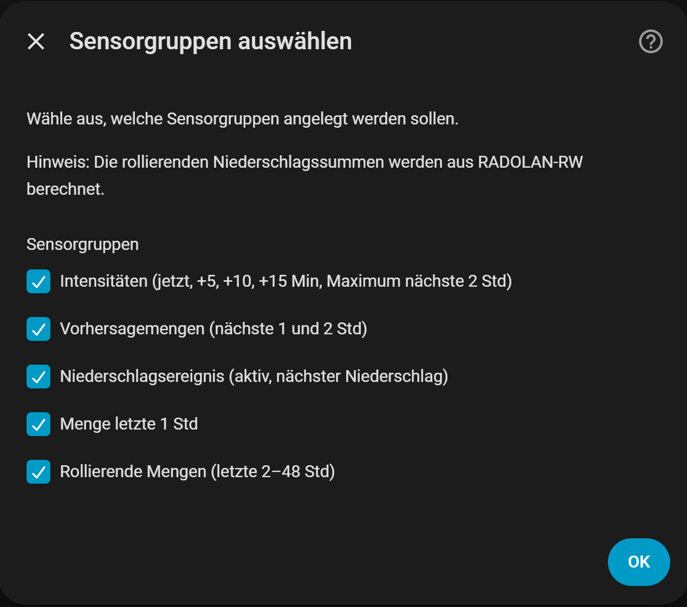
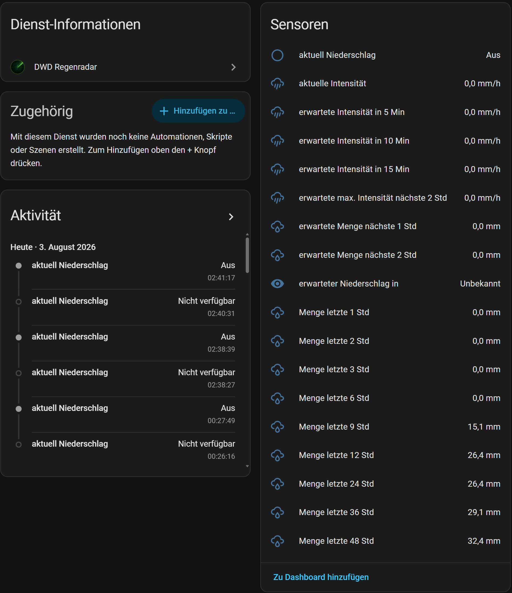

# DWD Regenradar

[](https://hacs.xyz/)


[](https://my.home-assistant.io/redirect/hacs_repository/?owner=Turavien&repository=dwd_rainradar)

[](https://my.home-assistant.io/redirect/config_flow_start/?domain=dwd_rainradar)

🇬🇧 English version: [README.md](README.md)

> **Hinweis**
>
> Dies ist keine offizielle Integration des Deutschen Wetterdienstes (DWD).
>
> Das Projekt wird unabhängig entwickelt und steht in keiner Verbindung zum Deutschen Wetterdienst.
>
> Verwendet werden ausschließlich öffentlich verfügbare Open-Data-Produkte des DWD.

Diese Custom Integration für Home Assistant stellt offizielle radarbasierte Niederschlagsdaten des Deutschen Wetterdienstes (DWD) bereit.

Sie kombiniert RADOLAN-Messungen mit RADVOR-Vorhersagen und erzeugt daraus Mess-, Vorhersage- und berechnete Entitäten für Home Assistant.

Typische Einsatzgebiete sind:

* automatische Gartenbewässerung
* Warnungen vor einsetzendem Regen bei geöffneten Fenstern
* wetterabhängige Hausautomatisierungen
* wetterabhängige Steuerung von Rollläden, Markisen und Außengeräten

Die Integration wird vollständig über die Benutzeroberfläche von Home Assistant konfiguriert. Während der Einrichtung können die gewünschten Sensorgruppen ausgewählt werden. Sensorgruppen lassen sich später jederzeit über die Integrationsoptionen aktivieren oder deaktivieren, ohne dass die Integration entfernt und neu eingerichtet werden muss.

> **Wichtig**
>
> Die Vorhersagesensoren liefern die **erwarteten Niederschlagssummen** für die nächsten
>
> * 1 Stunde
> * 2 Stunden
>
> Jeder Wert beschreibt die Niederschlagsmenge, die innerhalb des jeweiligen Vorhersagezeitraums voraussichtlich insgesamt fallen wird. Es handelt sich **nicht** um momentane Niederschlagsintensitäten.

## Screenshots

### Integration



### Optionen



### Entitäten



## Funktionen

* Offizielle DWD-Radarprodukte (RADOLAN & RADVOR)
* Gemessene, vorhergesagte und berechnete Niederschlagsdaten
* Automatische Auswahl der passenden Radarrasterzelle
* Optionale Sensorgruppen
* Niederschlagssummen bis 48 Stunden
* Vollständige ConfigFlow- und OptionsFlow-Unterstützung
* Automatische Bereinigung deaktivierter Entitäten
* Deutsche und englische Übersetzungen

## Funktionsweise

Die Integration verwendet ausschließlich offizielle Radarprodukte des Deutschen Wetterdienstes (DWD).

Die Radardaten liegen auf einem Raster von etwa **1 km × 1 km**. Während der Einrichtung wird automatisch die nächstgelegene Rasterzelle ausgewählt, aus der anschließend alle Entitäten berechnet werden.

Die Integration verwendet folgende DWD-Produkte:

* RADOLAN RW
* RADVOR RS
* RADVOR RV

Sie stellt folgende Entitäten bereit:

### Historischer Niederschlag

* Niederschlag der letzten Stunde [mm]
* Niederschlag der letzten 2 Stunden [mm]
* Niederschlag der letzten 3 Stunden [mm]
* Niederschlag der letzten 6 Stunden [mm]
* Niederschlag der letzten 9 Stunden [mm]
* Niederschlag der letzten 12 Stunden [mm]
* Niederschlag der letzten 24 Stunden [mm]
* Niederschlag der letzten 36 Stunden [mm]
* Niederschlag der letzten 48 Stunden [mm]

### Niederschlagsvorhersage

* Erwartete Niederschlagssumme der nächsten Stunde [mm]
* Erwartete Niederschlagssumme der nächsten 2 Stunden [mm]

### Aktueller Niederschlag

* Aktuelle Niederschlagsintensität [mm/h]
* Erwartete Niederschlagsintensität in 5 Minuten [mm/h]
* Erwartete Niederschlagsintensität in 10 Minuten [mm/h]
* Erwartete Niederschlagsintensität in 15 Minuten [mm/h]

### Niederschlagsereignis

* Zeit bis zum nächsten Niederschlag [min]
* Erwartete max. Niederschlagsintensität nächsten 2 Std [mm/h]
* Niederschlag aktiv (Binärsensor)

Diese Sensorgruppe kombiniert Informationen zum unmittelbar bevorstehenden Niederschlag sowie zur höchsten vorhergesagten Niederschlagsintensität innerhalb des zweistündigen RADVOR-Vorhersagezeitraums.

## Datenquellen

Alle Daten stammen aus öffentlich verfügbaren Open-Data-Produkten des Deutschen Wetterdienstes (DWD), die jeweils unterschiedliche Aufgaben erfüllen.

### RADOLAN RW

Radarbasierte Niederschlagssumme der letzten Stunde.

Die Integration speichert aufeinanderfolgende RW-Produkte lokal und berechnet daraus sämtliche historischen Niederschlagssummen (1 h, 2 h, 3 h, 6 h, 9 h, 12 h, 24 h, 36 h und 48 h).

### RADVOR RS

Radarbasierte Vorhersage kumulierter Niederschlagssummen für die kommenden 120 Minuten mit einer zeitlichen Auflösung von fünf Minuten.

Dieses Produkt liefert die erwarteten Niederschlagssummen für die nächsten 1 und 2 Stunden.

### RADVOR RV

Radarbasierte Vorhersage der Niederschlagsintensität für die kommenden 120 Minuten mit einer zeitlichen Auflösung von fünf Minuten.

Aus diesem Produkt werden die aktuellen und zukünftigen Niederschlagsintensitäten, der Binärsensor **„Niederschlag aktiv“** sowie der Zeitpunkt des nächsten erwarteten Niederschlags abgeleitet.

## Installation über HACS

1. **HACS** öffnen.
2. Dieses Repository als **Benutzerdefiniertes Repository** hinzufügen.
3. Die Kategorie **Integration** auswählen.
4. **DWD Regenradar** installieren.
5. Home Assistant neu starten.

Nach dem Neustart:

1. Zu **Einstellungen → Geräte & Dienste** wechseln.
2. **Integration hinzufügen** auswählen.
3. Nach **DWD Regenradar** suchen.
4. Den gewünschten Standort eingeben oder auf der Karte auswählen.
5. Die gewünschten Sensorgruppen auswählen.
6. Die Einrichtung abschließen.

## Projektgeschichte

DWD Regenradar entstand als Fortführung der Integration [DWD Precipitation](https://github.com/Hoffmann77/ha-dwd-precipitation), die von [@Hoffmann77](https://github.com/Hoffmann77) entwickelt wurde.

Nachdem der Deutsche Wetterdienst (DWD) seine Radarprodukte auf das HDF5-Format umgestellt hatte, erforderte die ursprüngliche Integration umfangreiche Anpassungen. Dieses Projekt konzentrierte sich zunächst auf die Wiederherstellung der Kompatibilität und entwickelte sich anschließend schrittweise zu einer eigenständigen Integration mit eigener Architektur, Konfigurationsfluss und Sensormodell.

## Lizenz und Hinweise

Dieses Projekt wird unter der MIT-Lizenz veröffentlicht.

Teile der Radarverarbeitung basieren auf Komponenten des **wradlib**-Projekts.

Die entsprechende Lizenz befindet sich in diesem Repository unter:

```text
custom_components/dwd_rainradar/radar/LICENSE.txt
```

## Feedback und Beiträge

Fehlerberichte, Funktionswünsche und Pull Requests können über GitHub eingereicht werden.

Fehler und Funktionswünsche können über den GitHub-Issue-Tracker gemeldet werden.
