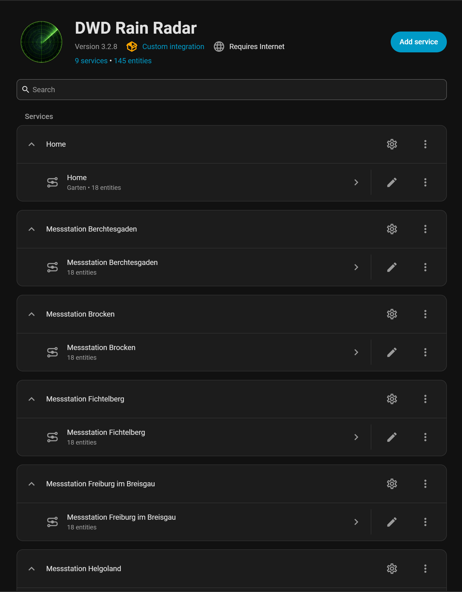
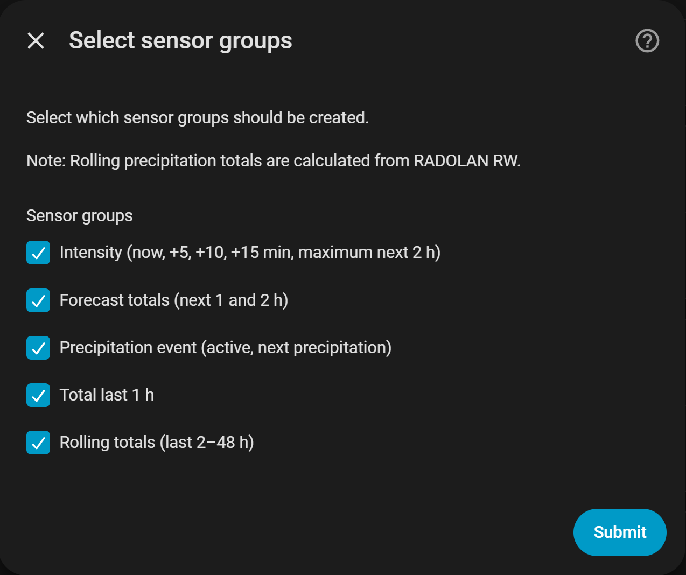
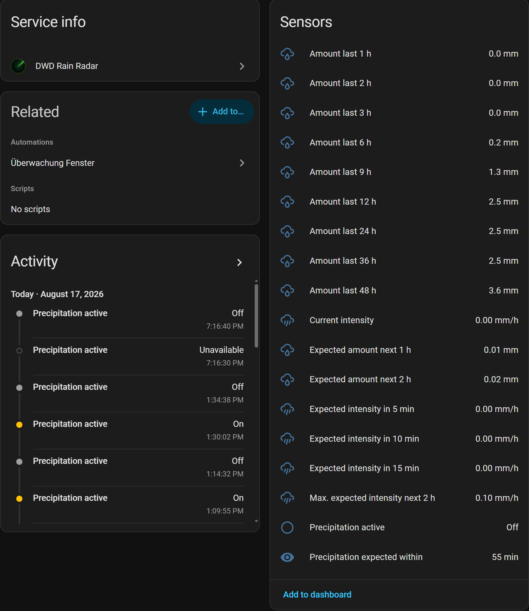

# DWD Rain Radar

[](https://hacs.xyz/)


[](https://www.home-assistant.io/)


[](https://my.home-assistant.io/redirect/hacs_repository/?owner=Turavien&repository=dwd_rainradar)

[](https://my.home-assistant.io/redirect/config_flow_start/?domain=dwd_rainradar)

🇩🇪 Deutsche Version: [README.de.md](README.de.md)

> **Note**
>
> This is not an official integration of the German Weather Service (_Deutscher Wetterdienst_, DWD).
>
> This project is developed independently and is not affiliated with the DWD.
>
> It uses publicly available DWD Open Data products only.

This custom Home Assistant integration brings official radar-based precipitation products from the German Weather Service (_Deutscher Wetterdienst_, DWD) into Home Assistant.

It combines RADOLAN measurements with RADVOR forecasts to provide measured, forecast and derived precipitation entities for a single radar grid cell.

Typical applications include:

* automated garden irrigation
* rain warnings for open windows
* weather-dependent home automations
* control of shutters, awnings and outdoor devices

The integration is fully configurable through the Home Assistant user interface. Sensor groups can be selected during setup and changed later at any time through the integration options.

> **Important**
>
> Forecast sensors report the **expected accumulated precipitation** for the upcoming
>
> * 1 hour
> * 2 hours
>
> Each value represents the total precipitation expected to fall during the corresponding forecast period. They are **not** instantaneous precipitation intensities.

## Screenshots

### Integration



### Options



### Entities



## Features

* Official DWD radar products (RADOLAN & RADVOR)
* Measured, forecast and derived precipitation entities
* Automatic radar grid selection for the configured location
* Optional sensor groups
* Rolling precipitation totals up to 48 hours
* Setup and options entirely through the Home Assistant user interface
* Automatic cleanup of entities no longer provided
* English and German translations

## How it works

The integration exclusively uses official DWD radar products.

Radar data is published on a grid of approximately **1 km × 1 km**. During setup, the nearest grid cell is selected automatically, and all entities are derived from this single location.

The integration uses the following DWD products:

* RADOLAN RW
* RADVOR RS
* RADVOR RV

It provides the following entities:

### Historical precipitation

* Total precipitation during the last hour [mm]
* Total precipitation during the last 2 hours [mm]
* Total precipitation during the last 3 hours [mm]
* Total precipitation during the last 6 hours [mm]
* Total precipitation during the last 9 hours [mm]
* Total precipitation during the last 12 hours [mm]
* Total precipitation during the last 24 hours [mm]
* Total precipitation during the last 36 hours [mm]
* Total precipitation during the last 48 hours [mm]

### Forecast precipitation

* Expected precipitation during the next hour [mm]
* Expected precipitation during the next 2 hours [mm]

### Precipitation intensity

* Current precipitation intensity [mm/h]
* Expected precipitation intensity in 5 minutes [mm/h]
* Expected precipitation intensity in 10 minutes [mm/h]
* Expected precipitation intensity in 15 minutes [mm/h]
* Maximum expected precipitation intensity during the next 2 hours [mm/h]

### Precipitation event

* Time until next expected precipitation [min]
* Precipitation active (binary sensor)

## Data Sources

The integration currently uses three official DWD Open Data radar products, each serving a specific purpose.

### RADOLAN RW

Gauge-adjusted radar-based precipitation total over one hour.

RW is published for overlapping time windows. The integration keeps the required RW history locally and selects a continuous sequence of non-overlapping hourly intervals for each calculation. This provides precipitation totals for 1 h, 2 h, 3 h, 6 h, 9 h, 12 h, 24 h, 36 h and 48 h.

### RADVOR RS

Radar-based one-hour precipitation forecast provided every five minutes for different forecast times.

For the next hour, the integration uses the interval from now to +60 minutes. For the next two hours, it adds the two non-overlapping intervals 0–60 and 60–120 minutes.

### RADVOR RV

Radar-based precipitation forecast in five-minute intervals covering the next 120 minutes.

The integration uses the interval ending at the current time for the current intensity. Forecasts in 5, 10 and 15 minutes refer to the five-minute interval ending at that time. The precipitation amount of each interval is converted to an equivalent intensity in mm/h. These values also provide the binary sensor **Precipitation active**, the time until precipitation is next expected and the maximum expected intensity.

## Installation via HACS

1. Open **HACS**.
2. Add this repository as a **Custom Repository**.
3. Select the category **Integration**.
4. Install **DWD Rain Radar**.
5. Restart Home Assistant.

After the restart:

1. Go to **Settings → Devices & Services**.
2. Click **Add Integration**.
3. Search for **DWD Rain Radar**.
4. Enter or select the desired location.
5. Select the sensor groups you want to create.
6. Finish the configuration.

## Removal

The integration can be removed from **Settings → Devices & Services → DWD Rain Radar** using the menu of the corresponding entry.

Locally stored radar data remains in `/config/dwd_rainradar`. If all integration entries have been removed and the data is no longer needed, this directory can be deleted manually.

## Project History

DWD Rain Radar originated as a continuation of the [DWD Precipitation](https://github.com/Hoffmann77/ha-dwd-precipitation) integration created by [@Hoffmann77](https://github.com/Hoffmann77).

When the German Weather Service (_Deutscher Wetterdienst_, DWD) migrated its radar products to HDF5, the original integration required substantial changes. This project started as a compatibility update and has since evolved into an independent integration with its own architecture, configuration flow and sensor model.

## License and Credits

This project is released under the MIT License.

Parts of the radar processing are based on components of the **wradlib** project.

The corresponding license is included in this repository:

```text
custom_components/dwd_rainradar/radar/LICENSE.txt
```

## Feedback and Contributions

Bug reports, feature requests and pull requests are welcome through the GitHub repository.
